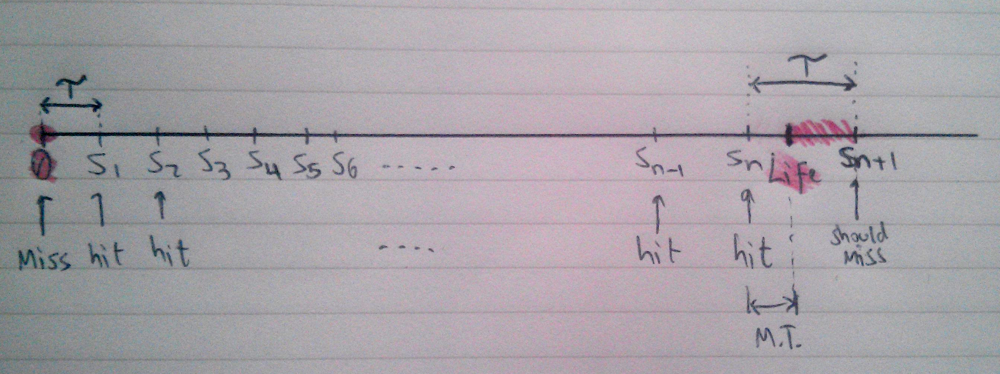
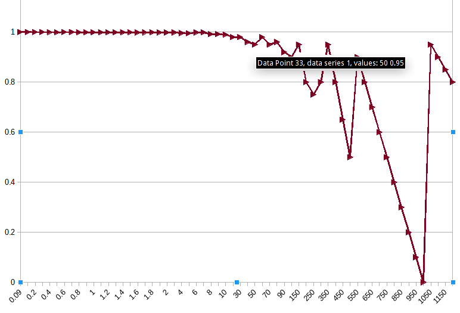

## The challenge

AllTheRooms accesses several slow APIs, and caching is critical. Assume the following functions exist:

    cache_store(callback,key,value);
    cache_retrieve(callback,key); 
    slow_function(callback,input);

The callbacks in the functions above will be called like `callback(error[, result])`. The functions don't actually return values.

Your job is to speed up slow_function by writing a memoize function. Speed is absolutely critical and therefore callbacks need to be called as soon as information is ready.

The input of memoize is slow_function and the output is a faster function that uses the above two caching functions.

    fast_function = memoize(slow_function); // runs faster than slow_function by using cache functions

The memoized function caches stored results using the above functions. The input parameter can be the cache key. The faster version returns cached results (via callback) if they exist, or else it returns the normal slow result (via callback). Please write the memoize function.

Now, sometimes the cache function can be slower than the slow_function. Please write a version of memoize that does the following:

1. Returns the faster of the cached result or the fresh result (via callback). This means if the cache request completes first, then that result should be returned via fast_function's callback, and if the slow_function completes first, then that result should be returned via fast_function's callback. This will result in the fastest possible version of fast_function.

2. Since we are always calling slow_function, we should always update the cache in either scenario. Of course this can happen after the appropriate callback was called

Bonus question:

If cached values have an accuracy half-life of 1000 seconds, what is the TTL to achieve 95% accuracy?

## The Solution

The memoize function is implemented in memoize.js as a nodejs module. The code was tested on Arch Linux running Node 4.4.0. There are tests in tests/memoize_tests.js

If you want to run the tests, do `npm install` and then `npm test`.

Explanations are given in the comments in both the implementation and test files. Please read.

## Answer to bonus question.

Without actual data from the servers, an analytical approach was required. 

First step was to look for relevant papers and "Modeling TTL-Based Internet Caches" by Jung, Berger and Balakrishnan was found (included in the ttl-analysis directory). They provide a formal model in by means of mathematical expressions to find the hit and miss ratios of a cache system given the TTL of the cache and the inter-query times of the system. The system assumed in this challenge is different to the one modeled in the paper, however, in that we are refreshing the cache every time there is a query (hit or miss). Their system only refreshes the cache after the TTL has expired. Nevertheless, the paper provided a logical framework for analyzing the problem and their notation and some assumptions were taken from it for the following analysis.

Let's make some assumptions:

* The half life of the queried data is a constant, positive number, given in seconds: "Life".
* The mean time between queries can be measured and is given: T.
* The query at time zero will always be a miss.
* Subsequent queries Sn will be hits until the data expires and so Sn+1 will be a miss.

Now, the following diagram illustrates how the time span where we will get cache misses is between Life and Sn+1 (shaded in red). 

The duration of this time span can be expressed as

    Miss Time (MS) = T - mod(Life,T)  (1)

And 

    Miss Rate = MT/Life               (2)
    Hit Rate (HR) = 1 - Miss Rate     (3)

Replacing (1) and (2) in (3), we get

    HR = 1 - (T-mod(Life,T))/Life     (4)

Setting a Life of 1000 seconds, here is a plot of HR vs T (spreadsheet included in the ttl-analysis directory):

We can see that for inter query times longer than 50 seconds, the hit rate goes below the required 95%. If we set a cache TTL of 50 seconds, we'll get a 95% hit rate.
